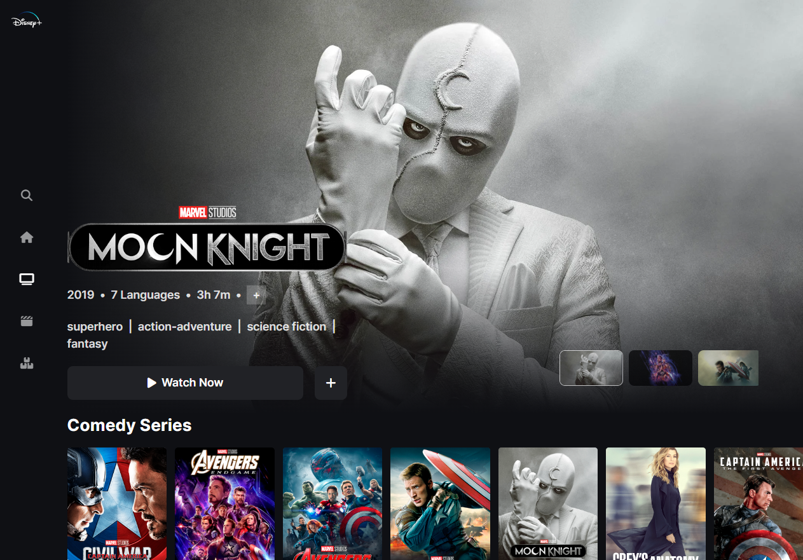
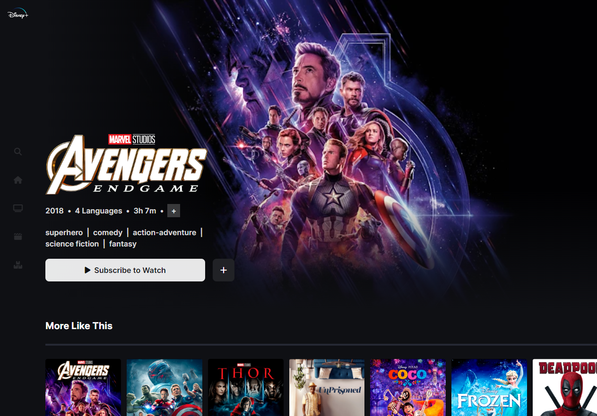

# Disney plus Clone

Developed a Disney clone website using Next.js, a popular React framework known for its server-side rendering capabilities, ensuring fast loading times and optimal performance..



## Live Demo

You can access the live demo [here](https://disney-olj2.onrender.com/).

## Description

The Disney clone website is a project developed using Next.js, Express.js, Tailwind CSS, and MongoDB. It aims to create a replica of the Disney website, offering users an immersive experience reminiscent of the magical world of Disney. By leveraging Next.js for server-side rendering, the website ensures fast loading times and optimal performance..

## Features

- Server-Side Rendering: Next.js allows for server-side rendering, enabling the website to load quickly and provide a seamless user experience. This ensures that users can navigate through the website and explore Disney-themed content without long loading times.

- Express.js Backend: The project utilizes Express.js as the backend framework, providing a robust and flexible server environment. Express.js enables efficient routing, handling of API requests, and data management.

- Tailwind CSS Styling: Tailwind CSS is employed for styling the website, offering a utility-first approach that allows for quick and consistent design implementation. With Tailwind CSS, creating visually appealing and responsive UI components becomes more streamlined.

- MongoDB Database: The website utilizes MongoDB as the database system, providing a scalable and flexible solution for storing and retrieving data. MongoDB's document-based structure allows for easy management of Disney-related content, such as movies, characters, and images.

- Disney-themed Content: The website offers a wide range of Disney-themed content, including movie information, character details, and images. Users can explore and interact with various Disney elements, bringing the magical world of Disney to life.

## Getting Started

To run the project locally, follow these steps:

1. Clone the repository:

   ```shell
   git clone https://github.com/Emam546/disney_plus_films
   ```
2. Install the dependencies:

   ```shell
   npm install
   ```

3. Start the development server:

    ```shell
   npm dev
   ```
| Route                | Description                                    |
|----------------------|------------------------------------------------|
| /                    | Home page of the website                        |
| /_app                | Main application page                           |
| /[name]              | Dynamic route for specific content              |
| /404 (404 ms)        | Error page displayed for invalid routes         |
| /api/search          | API route for searching functionality           |
| /company/[name]      | Dynamic route for displaying company details     |
| /movies/[name]       | Dynamic route for displaying movie details       |
****